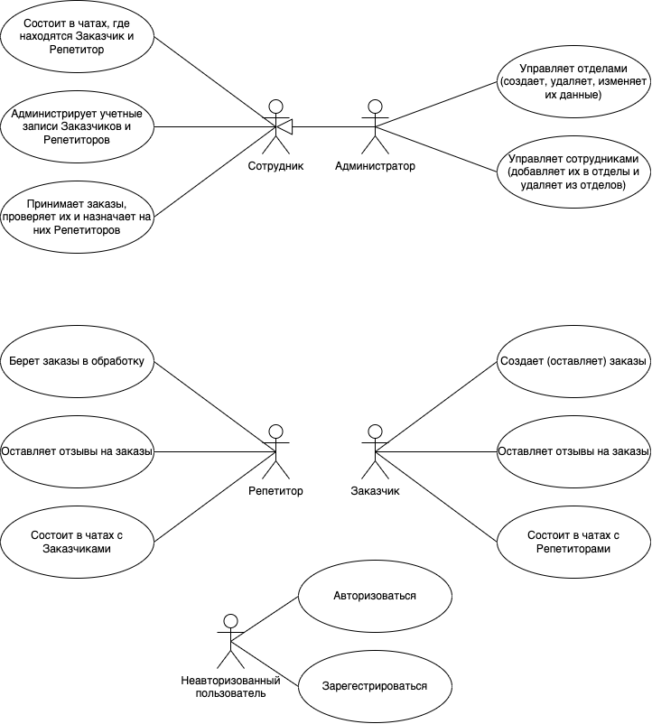
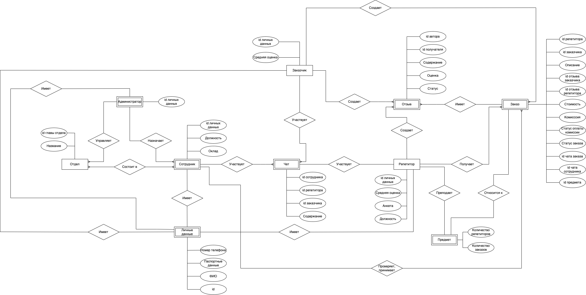
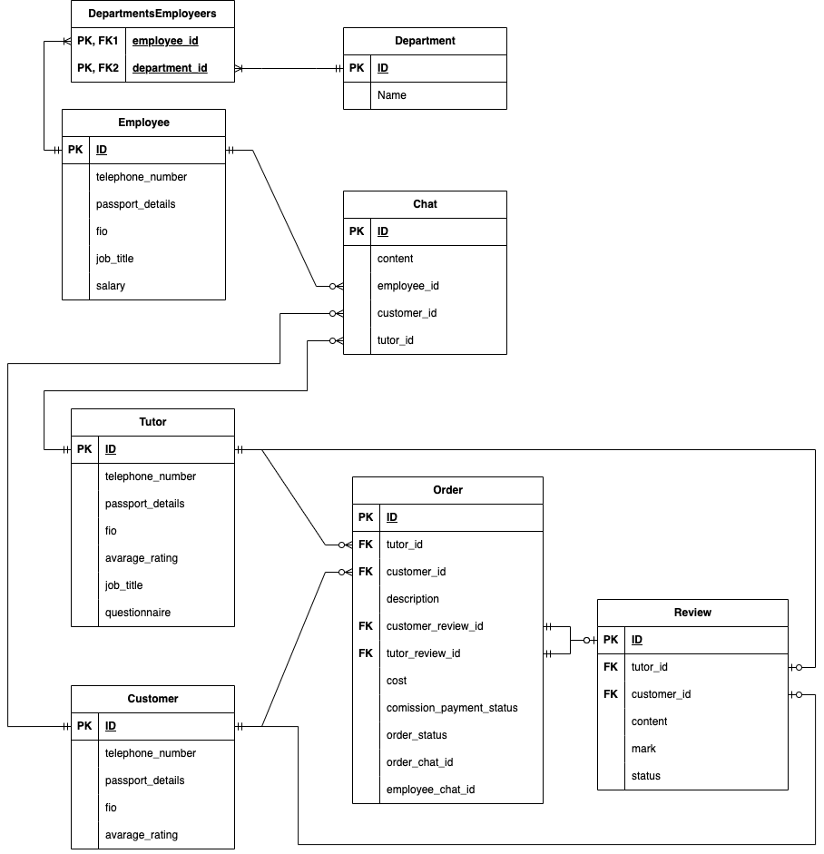
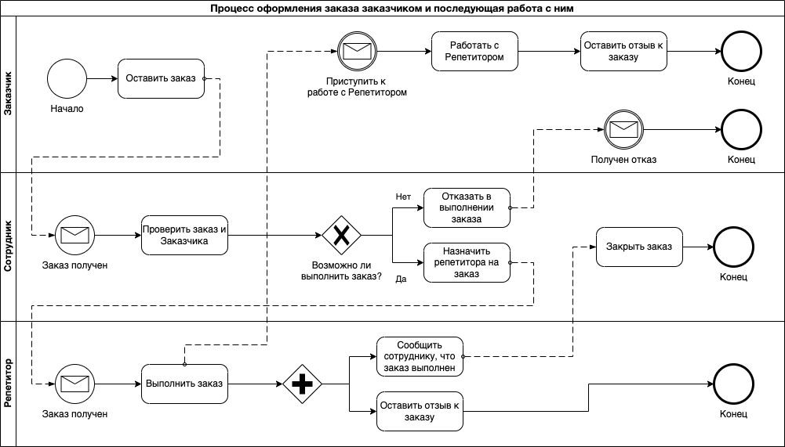
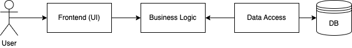
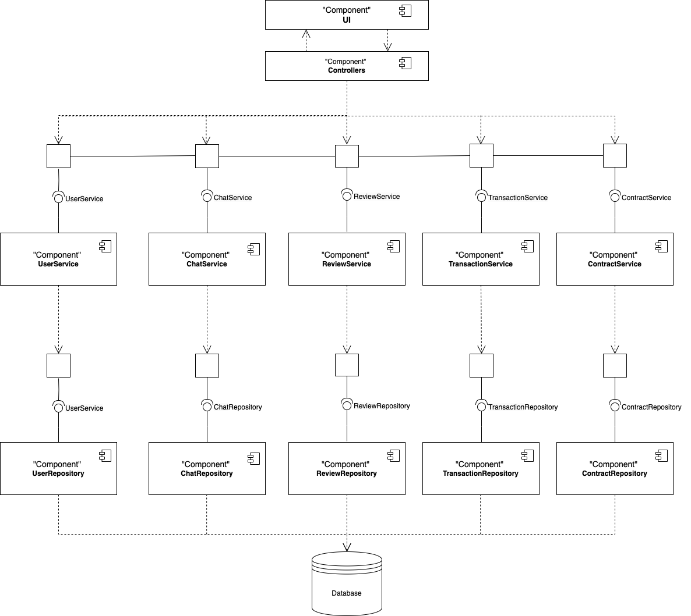
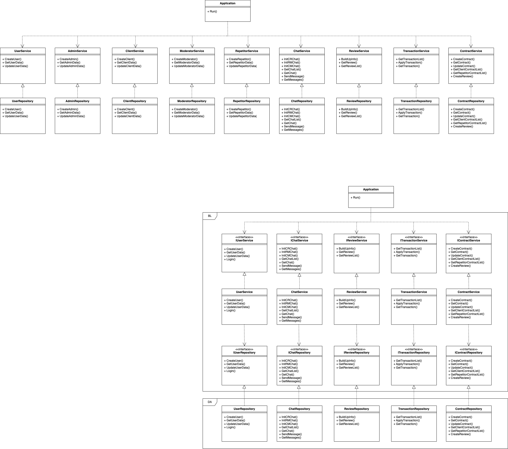

## Название: Сайт репетиторства

## Части проекта
- [WEB](./web)
- [TESTING](https://github.com/marineett/TESTING)

## Краткое описание идеи проекта

Проект представляет собой веб-приложение для поиска и заказа репетиторских услуг. Клиенты могут размещать заказы на занятия, а сотрудники проверяют их и назначают подходящего репетитора. В приложении реализована система чатов для взаимодействия между заказчиками и репетиторами, а также возможность оставлять отзывы.

## Краткое описание предметной области

Приложение предназначено для взаимодействия между заказчиками, репетиторами и сотрудниками. Основные функции включают размещение заказов, подбор репетиторов, ведение чатов, управление учетными записями и отделами, а также систему отзывов. Система позволяет автоматизировать процесс поиска репетиторов и взаимодействия между пользователями, обеспечивая удобство.

## Краткий анализ аналогичных решений

| Название        | Поиск репетиторов | Чаты | Отзывы | Фильтрация по предметам | Онлайн/Офлайн |
| --------------- | ----------------- | ---- | ------ | ----------------------- | ------------- |
| **Skyeng**      | +                 | +    | +      | +                       | Только онлайн | 
| **TutorOnline** | +                 | -    | +      | +                       | Только онлайн | 
| **Preply**      | +                 | +    | -      | +                       | Онлайн/Офлайн | 
| **Мой проект***  | +                 | +    | +      | +                       | Онлайн/Офлайн |

## Актуальность и уникальность проекта

Современные технологии делают поиск репетиторов проще и доступнее. Однако многие существующие платформы либо не обладают нужным функционалом, либо неудобны в использовании.

Данный проект выделяется благодаря следующим особенностям:

1. **Поиск репетиторов**: наличие у пользователей возможности выбирать репетиторов по своему желанию.
2. **Модерируемые чаты**: сотрудники платформы следят за общением между пользователями, предотвращая мошенничество и обеспечивая безопасность для всех участников.
3. **Отзывы**: наличие возможности оставлять отзывы как на пользователей, так и на репетиторов, что обеспечивает прозрачность при выборе репетиторов и при принятии заказов от пользователей.
4. **Режим обучения**: возможность заниматься как офлайн, так и онлайн.

## Краткое описание акторов (ролей)

- **Сотрудник**: состоит в чатах с заказчиками и репетиторами, администрирует учетные записи пользователей, принимает заказы, проверяет их и назначает репетиторов.
- **Администратор**: управляет отделами (создает, удаляет, изменяет их данные), управляет сотрудниками (добавляет их в отделы и удаляет из отделов).
- **Репетитор**: берет заказы в обработку, оставляет отзывы на заказы, состоит в чатах с заказчиками.
- **Заказчик**: создает заказы, оставляет отзывы на заказы, состоит в чатах с репетиторами.

## Use-Case диаграмма

## ER-диаграмма сущностей

Основные сущности:

- Сотрудник
- Заказчик
- Репетитор
- Администратор
- Личные данные
- Отдел
- Чат
- Отзыв
- Заказ

## Диаграмма базы данных

## Пользовательские сценарии

### 1. Создание заказа заказчиком

1. Заказчик заходит в систему (авторизуется или регистрируется).
2. Выбирает предмет, по которому требуется репетитор.
3. Переходит на страницу создания заказа.
4. Заполняет информацию о заказе:
   - **Предмет** (математика, физика, английский и т. д.)
   - **Уровень подготовки** (школьник, студент, подготовка к экзамену, доп. курсы, иностранные языки, поступление в ВУЗ, олимпиады)
   - **Желаемая стоимость** (диапазон или фиксированная цена)
   - **Формат занятий** (онлайн/офлайн)
   - **Дополнительные пожелания** (например, "нужен носитель языка")
5. Подтверждает заказ.

### 2. Обработка заказа сотрудником

1. Сотрудник получает уведомление о новом заказе.
2. Проверяет корректность данных.
3. Ищет подходящего репетитора.
4. Назначает репетитора.
5. Заказчик получает уведомление о назначении репетитора.

### 3. Взаимодействие через чат

1. После назначения репетитора создается чат между заказчиком и репетитором.
2. Заказчик и репетитор могут обмениваться сообщениями.
3. Сотрудник может модерировать чат при необходимости.

### 4. Проведение занятия и завершение заказа

1. Репетитор проводит занятие.
2. Заказчик подтверждает, что услуга оказана.
3. Система автоматически завершает заказ.
4. Заказчик может оставить отзыв о репетиторе.

## Формализация ключевых бизнес-процессов (BPMN)

## Технологический стек

**Тип приложения**: Web-SPA (Single Page Application)  
Проект представляет собой веб-приложение для поиска репетиторских услуг. Веб-приложение будет реализовано как одностраничное приложение, чтобы обеспечить плавное взаимодействие с пользователем без необходимости перезагрузки страницы.

**Технологический стек**:
- **Frontend**: TypeScript, React  
  TypeScript обусловлен строгой типизацией, что улучшает качество кода. React будет использован для создания динамичного интерфейса.
- **Backend**: Go (Golang)  
  Go выбран за производительность, простоту и поддержку многозадачности, это важно при обработке большого количества запросов.
- **СУБД**: PostgreSQL + DBeaver  
  PostgreSQL - надежная и масштабируемая реляционная БД, DBeaver - инструмент для удобного администрирования базы данных.
- **Взаимодействие**: REST API  
  Взаимодействие между фронтендом и бэкендом будет осуществляться через REST API.
- **Контейнеризация:** Docker, Docker-compose  

## Верхнеуровневое разбиение на компоненты
Приложение состоит из трех основных компонентов:

1. **Компонент реализации UI (Frontend)**:
   - Отвечает за отображение интерфейса пользователя.
   - Включает страницы для заказчиков, репетиторов, сотрудников и администраторов.
   - Взаимодействует с бэкендом через REST API.

2. **Компонент реализации бизнес-логики (Backend)**:
   - Обрабатывает запросы от фронтенда.
   - Содержит логику работы с заказами, чатами, отзывами, пользователями и транзакциями.
   - Взаимодействует с компонентом доступа к данным для получения и сохранения информации.

3. **Компонент доступа к данным (Data Access)**:
   - Взаимодействует с базой данных.
   - Включает репозитории для работы с сущностями (пользователи, заказы, чаты, отзывы и т.д.).
   - Использует паттерн **Repository** для абстракции доступа к данным.

**Диаграмма компонентов**:  

**Принцип инверсии зависимостей**:
- Компонент бизнес-логики зависит от абстракций (интерфейсов) репозиториев, а не от их конкретных реализаций.
- Это позволяет легко менять реализацию репозиториев (например, перейти с PostgreSQL на другую СУБД) без изменения бизнес-логики.

**Диаграмма классов**:  

